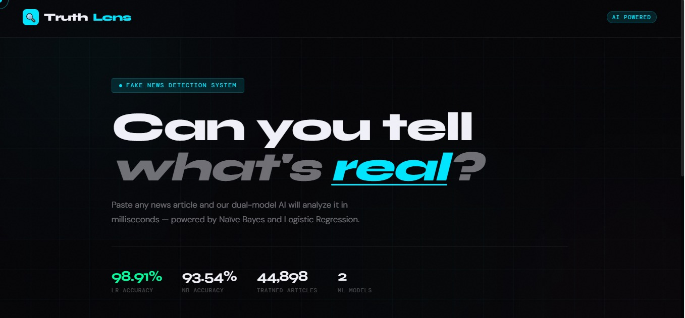
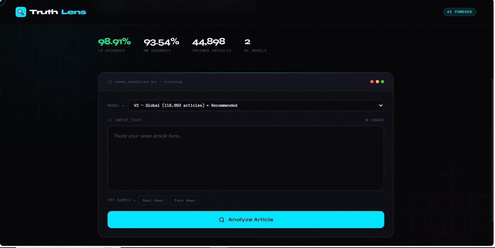
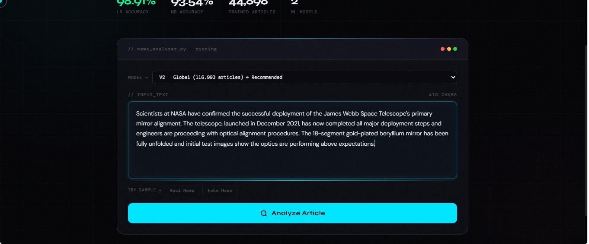
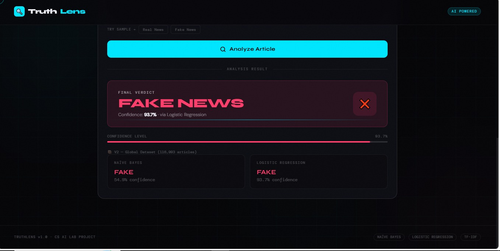
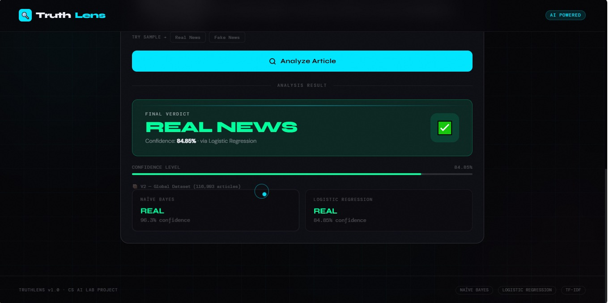

# 🔍 TruthLens — Fake News Detection System


> **"Can you tell what's real?"** — Paste any news article and TruthLens analyzes it in milliseconds using dual ML models.

---

## 📸 Preview

| Home | Analyzer | Sample Input |
|------|----------|--------------|
|  |  |  |

| Fake Result | Real Result |
|-------------|-------------|
|  |  |

---

## ⚡ Features

- 🧠 **Dual-Model AI** — Naïve Bayes + Logistic Regression working together
- 🌍 **Two Versions** — V1 (Political News) and V2 (Global/Multi-Domain)
- 📊 **Confidence Scoring** — Shows prediction confidence percentage
- 🎯 **98.91% LR Accuracy** — Trained on 44,898+ articles
- 💻 **Clean Terminal-style UI** — Dark theme with real-time analysis
- 🔬 **Sample Testing** — Built-in Real News & Fake News samples

---

## 🏗️ Project Structure

```
fake_news_detector/
│
├── app.py                  # Flask application & routes
├── model.py                # V1 model training (Political)
├── model_v2.py             # V2 model training (Global)
│
├── templates/
│   └── index.html          # Frontend UI (TruthLens)
│
├── lr_model.pkl            # Logistic Regression V1
├── nb_model.pkl            # Naïve Bayes V1
├── lr_model_v2.pkl         # Logistic Regression V2
├── nb_model_v2.pkl         # Naïve Bayes V2
├── tfidf.pkl               # TF-IDF Vectorizer V1
├── tfidf_v2.pkl            # TF-IDF Vectorizer V2
│
├── requirements.txt        # Python dependencies
└── README.md
```

---

## 📊 Model Performance

| Model | Version | Accuracy |
|-------|---------|----------|
| Logistic Regression | V1 — Political | **98.91%** |
| Naïve Bayes | V1 — Political | **93.54%** |
| Logistic Regression | V2 — Global | Trained on 116,993 articles |
| Naïve Bayes | V2 — Global | Trained on 116,993 articles |

---

## 🗂️ Datasets

> Data files are not included in this repo due to size. Download from Kaggle:

| Dataset | Articles | Use |
|---------|----------|-----|
| [Fake and Real News Dataset](https://www.kaggle.com/datasets/clmentbisaillon/fake-and-real-news-dataset) | ~44,898 | V1 — Political News |
| [Fake News Classification](https://www.kaggle.com/datasets/saurabhshahane/fake-news-classification) | ~116,993 | V2 — Global/Multi-Domain |

After downloading, place CSV files inside a `data/` folder in the project root.

---

## 🚀 Getting Started

### 1. Clone the Repository
```bash
git clone https://github.com/adrashbhatia/fake_news_detector.git
cd fake_news_detector
```

### 2. Install Dependencies
```bash
pip install -r requirements.txt
```

### 3. Download Datasets
Download both datasets from the links above and place them in:
```
data/
├── Fake.csv
├── True.csv
└── WELFake_Dataset.csv
```

### 4. Train the Models (if needed)
```bash
python model.py       # Train V1 models
python model_v2.py    # Train V2 models
```

> ⚠️ Pre-trained `.pkl` files are already included — skip this step if they exist.

### 5. Run the App
```bash
python app.py
```

Open your browser and go to: **http://localhost:5000**

---

## 🛠️ Tech Stack

| Layer | Technology |
|-------|-----------|
| Backend | Python, Flask |
| ML Models | Scikit-learn (NB + LR) |
| Text Processing | TF-IDF Vectorizer, NLTK |
| Frontend | HTML, CSS, JavaScript |
| Serialization | Pickle |

---

## 📖 How It Works

1. User pastes a news article into the input box
2. Text is preprocessed — stopwords removed, lowercased, cleaned
3. TF-IDF vectorizer converts text to numerical features
4. Both **Naïve Bayes** and **Logistic Regression** models predict independently
5. Final verdict shown with confidence score

---

## 👨‍💻 Author

**Adrash Bhatia**
- GitHub: [@adrashbhatia](https://github.com/adrashbhatia)

---

## 📄 License

This project is licensed under the MIT License.

---

<p align="center">
  <b>TRUTHLENS v1.0 — CS AI LAB PROJECT</b><br>
  <i>Built with Python, Flask & Machine Learning</i>
</p>
